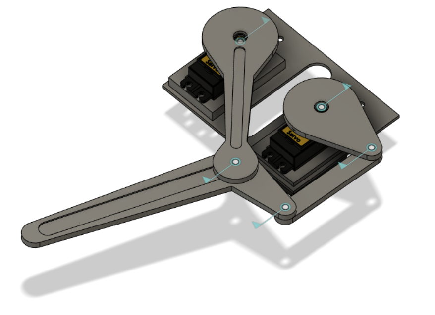
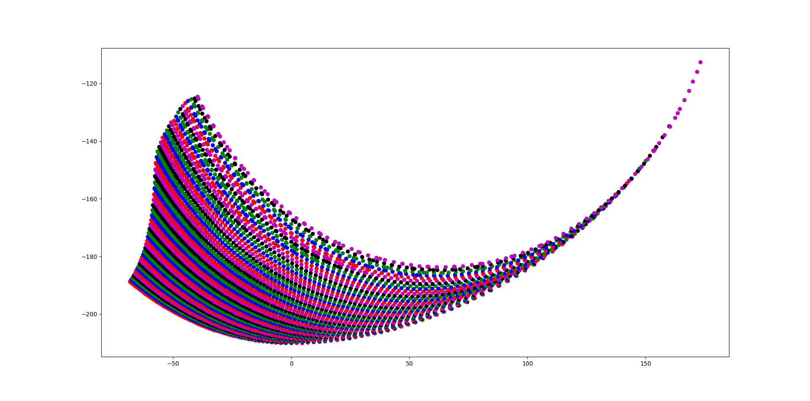

# 2D Leg using a Planar Mechanism

Our Mechanism has five bars, out of which one of the links are fixed, and two are driven using MG996 Servos. The servos are controlled using the Adafruit Servo Driver PCA9685, so that we can easily scale it up two four legs, which could require upto 12 servos.

## CAD Model for the leg

Here is an image that shows the CAD model of the leg, with all the parts assembled

## Geometric Structure of the leg

This figure shows the geometry of the leg, with $\alpha$ and $\beta$ being the controllable angles

The constants in this figure are:\
$O = 65 mm$\
$T = 90 mm$\
$C = 40 mm$\
$R = 40 mm$\
$CU = 63.654148805222384 mm$\
$L = 120$

## Joint Space

The next plot shows the joint space of the leg, in other words, the values that $\alpha$ and $\beta$ in the geometry

## Workspace of toe

Here we show the workspace of the leg, that is, the points that the toe can take for all the different $(\alpha, \beta)$ pairs in the joint space

## Forward kinematics

Forward Kinematics help us find the coordinates of the toe, given the state $(\alpha, \beta)$. With reference to the geometry of the leg, the equations can be formulated as:

$$ f = \sqrt{(O^2 + T^2 - 2OTcos(\alpha))} \\ sin(\theta) = \frac{Tsin(\alpha)}{f} $$
$$ sin(\delta) = \frac{Osin(\alpha)}{f} $$
$$ \epsilon = \pi - \theta - \beta $$
$$ t = \sqrt{(f^2 + C^2 - 2fCcos(\epsilon))} $$
$$ cos(x) = \sqrt{R^2 + CU^2 - t^2} $$
$$ \phi = arcsin(\frac{CUsin(x)}{t}) + arcsin(\frac{Csin(\epsilon)}{t}) $$
$$ \gamma = 2\pi - \delta - \phi - 110^{\circ} $$
$$ t_x = Tcos(\alpha) - Lcos(\gamma - \alpha) $$
$$ t_y = Tsin(\alpha) + Lsin(\gamma - \alpha) $$

Also, for a given $\alpha$, the limits on $\epsilon$ can be found by applying cosine rule on the two extreme cases when 

a) Crank and Coupler links are aligned in a straight line:
$ \epsilon_l = \sqrt{\frac{(C+CU)^2 + f^2 - R^2}{2(C+CU)f}} $

b) Rocker and Coupler links are aligned in a straigh line:
$ \epsilon_h = \sqrt{\frac{C^2 + f^2 - (CU + R)^2}{2Cf}} $

The limits on $\epsilon$ helps us determine the limits on $\beta$ for a particular $\alpha$ using $\beta = \pi - \theta - \epsilon$

## Inverse Kinematics

Using the above set of equations, we can model a non linear function $\mathbf{F}(\alpha, \beta)$ that returns the position of toe of the leg

$$ \mathbf{F}(\alpha, \beta) = \mathbf{X} = \begin{pmatrix} t_x \\ t_y \end{pmatrix} $$

For a given desired state **$X^*$**, inverse kinematics requires us to solve the system $\mathbf{F}(\alpha, \beta) = \mathbf{X^*}$ for $\alpha$ and $\beta$. This can be rewritten as

$$ \mathbf{G}(\alpha, \beta) = \begin{pmatrix} G_x \\ G_y\end{pmatrix} = \begin{pmatrix} F_x(\alpha, \beta)-t_x^* \\ F_y(\alpha, \beta) - t_y^*\end{pmatrix} = 0 $$

This is solved using **Newton's Method**, and converges in a fairly small number of iterations. We start with a guess solution $(\alpha_0, \beta_0)$ and iteratively improve upon it according to the following update rule

$$ \begin{pmatrix} \alpha_i \\ \beta_i\end{pmatrix} = \begin{pmatrix} \alpha_{i-1} \\ \beta_{i-1} \end{pmatrix} - \mathbf{J}^{-1}\mathbf{G}(\alpha_{i-1}, \beta_{i-1}) $$

Where $\textbf{J}$ is the Jacobian of $\textbf{G}$ evaluated at the current guess, that is $(\alpha_{i-1}, \beta_{i-1})$. The Jacobian $\textbf{J}$ can be evaluated numerically as,

$$ \mathbf{J} = \begin{pmatrix} \frac{F_x(\alpha + \Delta\alpha, \beta) - F_x(\alpha, \beta)}{\Delta\alpha} & \frac{F_x(\alpha + \alpha, \beta + \Delta\beta) - F_x(\alpha, \beta)}{\Delta\beta} \\
\frac{F_y(\alpha + \Delta\alpha, \beta) - F_y(\alpha, \beta)}{\Delta\alpha} &  \frac{F_y(\alpha + \alpha, \beta + \Delta\beta) - F_y(\alpha, \beta)}{\Delta\beta} \end{pmatrix}$$